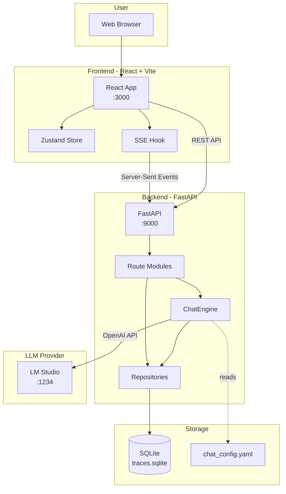
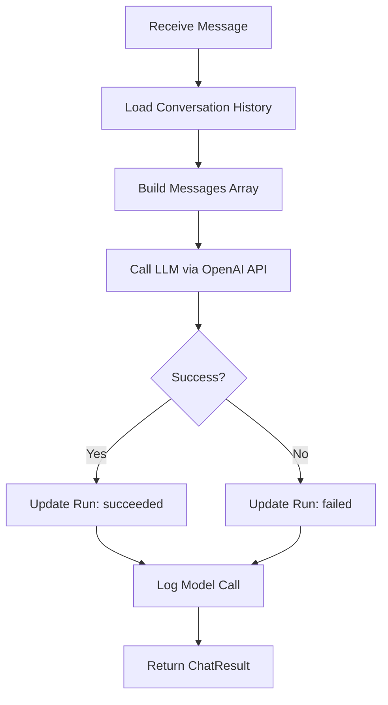
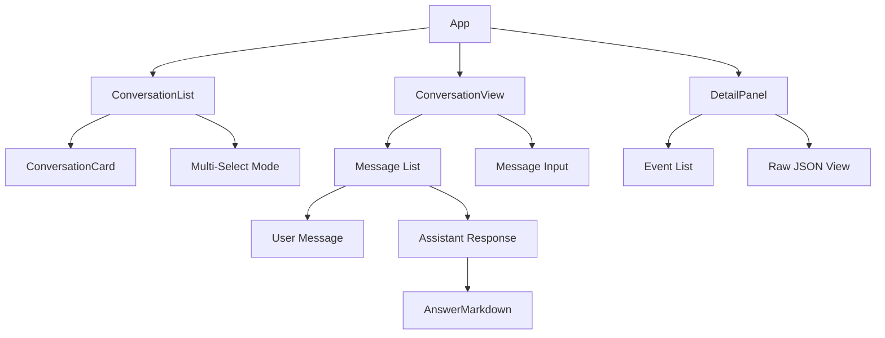
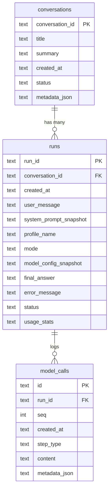
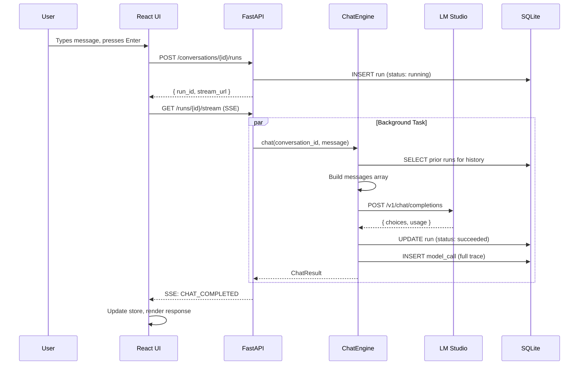
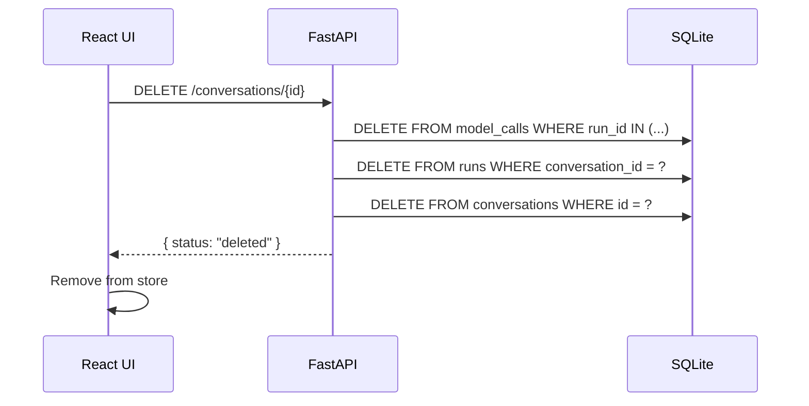
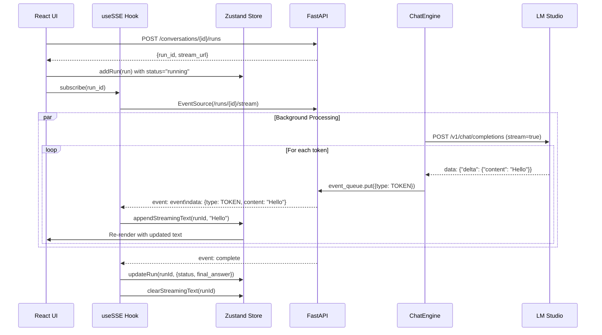

# Reasoner Architecture

A local AI chat application with full traceability, built with **FastAPI** (backend) and **React** (frontend).

> 📊 **Interactive Diagram**: Open [architecture-diagram.html](./architecture-diagram.html) in your browser for a visual, step-by-step walkthrough of the complete data flow.

---

## Table of Contents
1. [System Overview](#system-overview)
2. [Directory Structure](#directory-structure)
3. [Backend Architecture](#backend-architecture)
4. [Frontend Architecture](#frontend-architecture)
5. [Database Schema](#database-schema)
6. [API Reference](#api-reference)
7. [Configuration](#configuration)
8. [Data Flows](#data-flows)
9. [Real-Time Token Streaming](#real-time-token-streaming)
10. [Tracing & Observability](#tracing--observability)

---

## System Overview



### Tech Stack

| Layer | Technology | Purpose |
|-------|------------|---------|
| Frontend | React 18 + TypeScript | UI components |
| State | Zustand | Client state management |
| Styling | Tailwind CSS | Utility-first CSS |
| Build | Vite | Fast dev server & bundler |
| Backend | FastAPI | REST API + SSE streaming |
| ORM | Raw SQLite + aiosqlite | Async database access |
| LLM | LM Studio | Local model inference |

---

## Directory Structure

```
reasoner/
├── orchestrator/                    # Backend (Python)
│   ├── app.py                       # FastAPI entry point (59 lines)
│   ├── config.py                    # Configuration loader (109 lines)
│   ├── chat_config.yaml             # Runtime settings
│   ├── schemas.py                   # Pydantic request/response models
│   │
│   ├── routes/                      # API route modules
│   │   ├── __init__.py
│   │   ├── conversations.py         # Conversation CRUD (108 lines)
│   │   └── runs.py                  # Run creation + SSE (337 lines)
│   │
│   ├── engine/                      # Core business logic
│   │   ├── __init__.py
│   │   └── chat_engine.py           # LLM orchestration (310 lines)
│   │
│   ├── storage/                     # Data layer
│   │   ├── db.py                    # SQLite connection manager
│   │   ├── schema.sql               # Table definitions
│   │   └── repositories/
│   │       ├── conversation_repo.py # Conversation CRUD
│   │       └── trace_repo.py        # Run & model call logging
│   │
│   ├── models/                      # LLM client
│   │   ├── base.py                  # Abstract interface
│   │   └── openai_compat.py         # OpenAI-compatible client
│   │
│   ├── reporting/                   # Report generation
│   │   └── report_builder.py        # Markdown reports
│   │
│   ├── utils/                       # Utilities
│   │   ├── tokens.py                # Token counting
│   │   └── prompts.py               # Prompt helpers
│   │
│   └── prompts/                     # Prompt templates
│       └── chat.txt                 # Default system prompt
│
├── ui/                              # Frontend (React)
│   ├── src/
│   │   ├── App.tsx                  # Main layout (collapsible sidebar)
│   │   ├── main.tsx                 # Entry point
│   │   ├── index.css                # Global styles + Tailwind
│   │   │
│   │   ├── api/
│   │   │   └── client.ts            # API client (155 lines)
│   │   │
│   │   ├── components/
│   │   │   ├── ConversationList.tsx # Sidebar with multi-select
│   │   │   ├── ConversationView.tsx # Chat messages view
│   │   │   ├── DetailPanel.tsx      # Debug trace viewer
│   │   │   ├── AnswerMarkdown.tsx   # Markdown renderer
│   │   │   ├── FinalAnswer.tsx      # Answer display
│   │   │   └── ui/                  # Reusable UI components
│   │   │       ├── button.tsx
│   │   │       ├── dialog.tsx
│   │   │       ├── card.tsx
│   │   │       └── ...
│   │   │
│   │   ├── hooks/
│   │   │   ├── useStore.ts          # Zustand store (222 lines)
│   │   │   └── useSSE.ts            # SSE subscription hook
│   │   │
│   │   ├── lib/
│   │   │   ├── utils.ts             # cn() helper
│   │   │   └── retry.ts             # Retry with backoff
│   │   │
│   │   └── types/
│   │       └── index.ts             # TypeScript interfaces
│   │
│   ├── index.html
│   ├── package.json
│   ├── vite.config.ts
│   └── tailwind.config.js
│
├── var/                             # Runtime data
│   └── traces.sqlite                # Database
│
├── logs/                            # Server logs
│   └── api.log
│
├── dev.sh                           # Development script
├── Procfile                         # Process manager config
└── pyproject.toml                   # Python dependencies
```

---

## Backend Architecture

### Entry Point: [app.py](file:///Users/anudeepgadige/Desktop/Projects/reasoner/orchestrator/app.py)

Minimal FastAPI setup that:
1. Configures CORS for local development
2. Registers route modules
3. Provides health and config endpoints

```python
app = FastAPI(title="Reasoner", version="0.2.0")
app.include_router(conversations.router)
app.include_router(runs.router)
```

---

### Routes

#### [conversations.py](file:///Users/anudeepgadige/Desktop/Projects/reasoner/orchestrator/routes/conversations.py)

| Endpoint | Method | Description |
|----------|--------|-------------|
| `/api/conversations` | POST | Create new conversation |
| `/api/conversations` | GET | List conversations |
| `/api/conversations/{id}` | GET | Get conversation with runs |
| `/api/conversations/{id}` | PATCH | Update title/status |
| `/api/conversations/{id}` | DELETE | Delete conversation + runs |

#### [runs.py](file:///Users/anudeepgadige/Desktop/Projects/reasoner/orchestrator/routes/runs.py)

| Endpoint | Method | Description |
|----------|--------|-------------|
| `/api/conversations/{id}/runs` | POST | Send message, get response |
| `/api/runs` | POST | Create standalone run |
| `/api/runs` | GET | List runs |
| `/api/runs/{id}` | GET | Get run details |
| `/api/runs/{id}/stream` | GET | SSE event stream |
| `/api/runs/{id}/events` | GET | Get logged events |
| `/api/runs/{id}/report` | GET | Get markdown report |

---

### ChatEngine: [chat_engine.py](file:///Users/anudeepgadige/Desktop/Projects/reasoner/orchestrator/engine/chat_engine.py)

The core orchestration component:



**Key Methods:**

| Method | Purpose |
|--------|---------|
| `chat()` | Main entry point - orchestrates full chat flow |
| `_build_messages()` | Constructs message array from history |
| `_call_model()` | Makes non-streaming HTTP request to LLM |
| `_call_model_streaming()` | Makes streaming request, emits TOKEN events |

---

### Repositories

#### [trace_repo.py](file:///Users/anudeepgadige/Desktop/Projects/reasoner/orchestrator/storage/repositories/trace_repo.py)

| Method | Table | Purpose |
|--------|-------|---------|
| `create_run()` | runs | Start a new run (status: running) |
| `update_run()` | runs | Update with result/status |
| `get_run()` | runs | Fetch run by ID |
| `list_runs()` | runs | List with filters |
| `add_model_call()` | model_calls | Log LLM API call |
| `get_model_calls()` | model_calls | Get call history |

#### [conversation_repo.py](file:///Users/anudeepgadige/Desktop/Projects/reasoner/orchestrator/storage/repositories/conversation_repo.py)

| Method | Purpose |
|--------|---------|
| `create()` | Create conversation |
| `get()` | Get by ID |
| `list()` | List with filters |
| `update()` | Update title/status/summary |
| `delete()` | Delete with cascade to runs/model_calls |

---

## Frontend Architecture

### State Management: [useStore.ts](file:///Users/anudeepgadige/Desktop/Projects/reasoner/ui/src/hooks/useStore.ts)

Zustand store with the following state shape:

```typescript
interface AppState {
  // Data
  conversations: Conversation[];
  selectedConversationId: string | null;
  runsByConversation: Record<string, Run[]>;
  selectedRunId: string | null;
  eventsByRun: Record<string, Event[]>;
  
  // UI State
  detailPanelOpen: boolean;
  selectedEventSeq: number | null;
  
  // Real-time Streaming State
  streamingRunId: string | null;           // Currently streaming run
  streamingText: Record<string, string>;   // runId → accumulated tokens
  
  // Connection
  isConnected: boolean;
  isLoading: boolean;
  error: string | null;
  
  // Fetch Tracking
  fetchingRuns: Set<string>;               // Prevent duplicate fetches
}
```

**Key Actions:**
| Action | Purpose |
|--------|---------|
| `appendStreamingText(runId, token)` | Append token to streaming text |
| `clearStreamingText(runId)` | Clear streaming text when complete |
| `setStreamingRunId(runId)` | Track which run is currently streaming |
| `updateRun(runId, updates)` | Update run status/final_answer |

**Selectors:**
- `useSelectedConversation()` - Current conversation
- `useConversationRuns(id)` - Runs for a conversation
- `useSelectedRun()` - Currently selected run
- `useRunEvents(id)` - Events for a run

---

### Components



| Component | File | Purpose |
|-----------|------|---------|
| App | App.tsx | Layout with resizable sidebar |
| ConversationList | ConversationList.tsx | Sidebar with conversation cards |
| ConversationView | ConversationView.tsx | Main chat interface |
| DetailPanel | DetailPanel.tsx | Debug trace viewer |
| AnswerMarkdown | AnswerMarkdown.tsx | Markdown renderer for responses |

---

### API Client: [client.ts](file:///Users/anudeepgadige/Desktop/Projects/reasoner/ui/src/api/client.ts)

```typescript
// Conversations
createConversation(request) → { conversation_id }
listConversations(status?, limit?) → { conversations, total }
getConversation(id) → { conversation, runs }
deleteConversation(id) → { status }

// Runs
createConversationRun(convId, { message }) → { run_id, stream_url }
getRun(id) → Run
getRunEvents(id, sinceSeq?) → { events }

// Streaming
subscribeToRun(runId, onEvent, onComplete, onError) → unsubscribe()
```

---

## Database Schema



### Table Details

#### `conversations`
| Column | Type | Description |
|--------|------|-------------|
| conversation_id | TEXT PK | UUID |
| title | TEXT | Auto-generated from first message |
| summary | TEXT | Rolling summary of turns |
| created_at | TEXT | ISO timestamp |
| status | TEXT | active, archived, closed |

#### `runs`
| Column | Type | Description |
|--------|------|-------------|
| run_id | TEXT PK | Short UUID (8 chars) |
| conversation_id | TEXT FK | Parent conversation |
| user_message | TEXT | User's input |
| final_answer | TEXT | Model's response |
| status | TEXT | running, succeeded, failed |
| usage_stats | JSON | Token counts, latency |
| model_config_snapshot | JSON | Temperature, max_tokens, etc. |

#### `model_calls`
| Column | Type | Description |
|--------|------|-------------|
| id | TEXT PK | UUID |
| run_id | TEXT FK | Parent run |
| seq | INT | Sequence number |
| content | TEXT | Response content |
| metadata_json | JSON | Full messages array, tokens, timing |

---

## API Reference

### Health Check
```http
GET /api/health
Response: { "status": "ok" }
```

### Configuration
```http
GET /api/config
Response: {
  "config": {
    "model": { "temperature": 0.7, "max_tokens": 4096 },
    "endpoint": "http://127.0.0.1:1234",
    ...
  }
}
```

### Create Conversation
```http
POST /api/conversations
Body: { "title": "optional" }
Response: { "conversation_id": "uuid" }
```

### Send Message
```http
POST /api/conversations/{id}/runs
Body: { "message": "Hello!" }
Response: { 
  "run_id": "abc123", 
  "stream_url": "/api/runs/abc123/stream" 
}
```

### SSE Stream
```http
GET /api/runs/{id}/stream
Events:
  event: event
  data: {"type": "CHAT_STARTED", "run_id": "..."}

  event: event
  data: {"type": "TOKEN", "run_id": "...", "content": "Hello"}  # Real-time token

  event: event
  data: {"type": "TOKEN", "run_id": "...", "content": " world"}  # Next token

  event: event  
  data: {"type": "CHAT_COMPLETED", "response": "..."}  # Full response

  event: complete
  data: {"run_id": "...", "status": "succeeded", "final_answer": "..."}
```

**Event Types:**
| Type | When Sent | Data |
|------|-----------|------|
| `CHAT_STARTED` | Run begins | `{run_id, conversation_id}` |
| `TOKEN` | Each token from LLM | `{run_id, content}` |
| `CHAT_COMPLETED` | LLM finished | `{run_id, response}` |
| `CHAT_FAILED` | Error occurred | `{run_id, error}` |

---

## Configuration

### [chat_config.yaml](file:///Users/anudeepgadige/Desktop/Projects/reasoner/orchestrator/chat_config.yaml)

```yaml
# LLM endpoint
endpoint: "http://127.0.0.1:1234"

# Model parameters
model:
  temperature: 0.7
  max_tokens: 4096
  seed: null          # Set for reproducibility

# Context management
context:
  max_messages: 50    # Keep last N turns
  max_tokens: 6000    # Token budget for history
  reserve_for_response: 2048
  truncation_strategy: sliding_window

# System prompt
system_prompt: "You are a helpful AI assistant..."

# Tracing
tracing:
  enabled: true
  log_level: info
  log_model_calls: true   # Log full messages/responses
```

---

## Data Flows

### Chat Message Flow



### Conversation Deletion Flow



---

## Real-Time Token Streaming

The application supports real-time token streaming, displaying LLM responses character-by-character as they're generated.

### How It Works



### Key Components

| Component | File | Role |
|-----------|------|------|
| `useSSE` | `hooks/useSSE.ts` | Manages EventSource connection |
| `appendStreamingText` | `hooks/useStore.ts` | Accumulates tokens in state |
| `_call_model_streaming` | `engine/chat_engine.py` | Streams from LLM, emits tokens |
| `event_queue` | `routes/runs.py` | asyncio.Queue bridges background task to SSE |

### Frontend Display

```typescript
// In ConversationView.tsx - RunMessage component
const streamingText = useStore((s) => s.streamingText[run.run_id] || '');
const displayText = run.status === 'running' ? streamingText : run.final_answer;
```

While `status === 'running'`, the UI shows `streamingText` (grows with each token). Once `status === 'succeeded'`, it shows `final_answer`.

---

## Tracing & Observability

Every chat interaction is fully logged for debugging and reproducibility:

### What's Captured

| Data Point | Location | Purpose |
|------------|----------|---------|
| User message | runs.user_message | Input tracking |
| System prompt | runs.system_prompt_snapshot | Prompt versioning |
| Model config | runs.model_config_snapshot | Reproducibility |
| Full messages array | model_calls.metadata_json | Exact API call |
| Full response | model_calls.content | Output tracking |
| Token counts | model_calls.metadata_json | Usage monitoring |
| Latency | model_calls.metadata_json | Performance |

### Example model_calls.metadata_json

```json
{
  "messages": [
    {"role": "system", "content": "You are a helpful..."},
    {"role": "user", "content": "Hello!"},
    {"role": "assistant", "content": "Previous response..."},
    {"role": "user", "content": "Current message"}
  ],
  "response": "Full model response here...",
  "input_tokens": 150,
  "output_tokens": 89,
  "timing_ms": 1234,
  "config_snapshot": {
    "model": {"temperature": 0.7, "max_tokens": 4096},
    "endpoint": "http://127.0.0.1:1234"
  }
}
```

### Use Cases

- **Debugging**: See exact messages sent to model
- **Reproducibility**: Replay with same config
- **Analytics**: Token usage trends, response times
- **Auditing**: Full conversation history

---

## Development

### Start Development Servers
```bash
./dev.sh start      # Start both API and UI
./dev.sh restart    # Restart all
./dev.sh logs       # Tail API logs
./dev.sh stop       # Stop all
```

### Ports
- **Frontend**: http://localhost:3000
- **Backend**: http://localhost:9000
- **LM Studio**: http://localhost:1234

### Key Files to Modify

| Task | File |
|------|------|
| Add API endpoint | orchestrator/routes/*.py |
| Change chat behavior | orchestrator/engine/chat_engine.py |
| Modify UI layout | ui/src/App.tsx |
| Add UI component | ui/src/components/ |
| Change LLM settings | orchestrator/chat_config.yaml |
